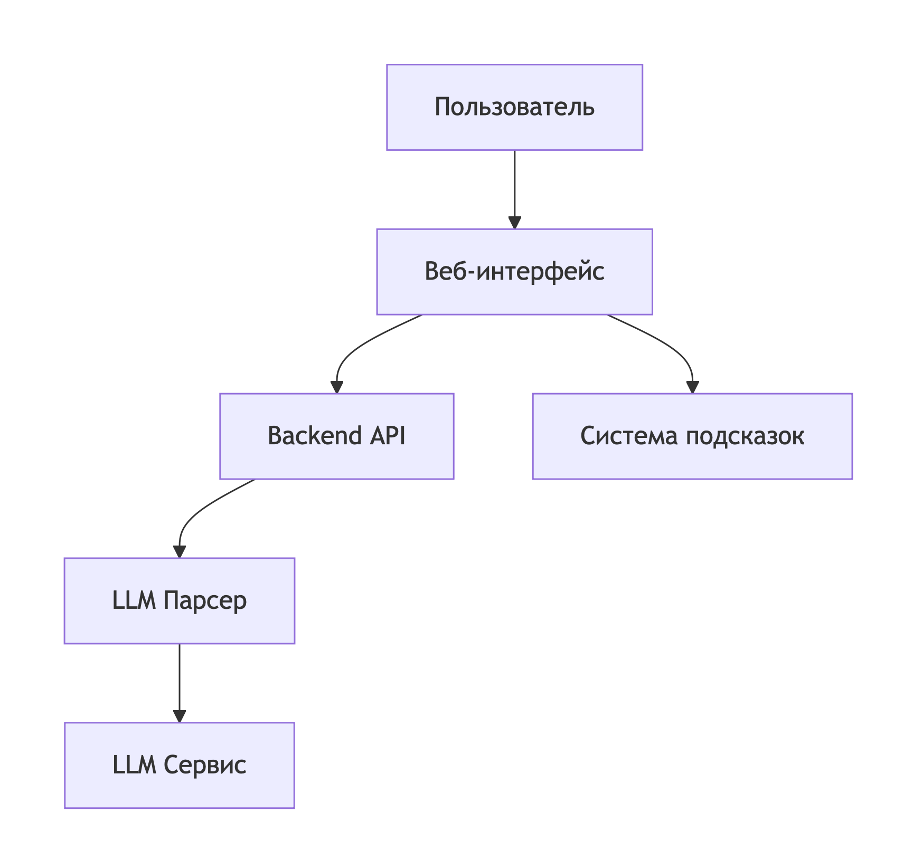

# Сервис для подготовки к собеседованиям через LLM

## Описание проекта

Веб-сервис для подготовки к собеседованиям с использованием Large Language Model (LLM). Сервис помогает пользователям преодолеть страх перед собеседованиями через интерактивную практику в реалистичных условиях.

### Основные возможности:
- Интерактивный диалог с ИИ-интервьюером
- Удобный интерфейс с подсказками и ответами
- Система оценки пользовательских ответов
- Адаптивные сценарии собеседований

## Архитектура системы

## Что видит пользователь

### Основной интерфейс:

- Приветственный экран
- Чат-интерфейс - диалог с ИИ-ассистентом в реальном времени
- Панель подсказок - вспомогательные материалы, примеры ответов, советы
- Система оценки - мгновенный фидбек по ответам пользователя

## Распределение задач в команде

### Елизавета

Проектирование и разработка интуитивно понятного веб-интерфейса - 2 дня
Создание надежной, масштабируемой и безопасной серверной архитектуры, которая обеспечивает стабильную и контекстно-зависимую беседу с ИИ-интервьюером. Создание docker файла - 3 дня
Описание функциональных требований к системе для Льва, включая логику диалога, условия показа подсказок и параметры оценки - 1 день
Тестирование MVP, сбор обратной связи - 2 дня

### Лев

Разработка backend-сервиса на FastAPI для обработки диалогов пользователя с LLM - 2 дня
Реализация единого эндпоинта /api/chat, принимающего историю сообщений и режим работы сервиса - 2 дня
Разработка прототипа интерфейса, на основе которого будет реализовываться фронтенд. Определение оптимального расположения элементов для снижения когнитивной нагрузки - 1 дня
Реализация динамического интерфейса чата с отображением ролей (Пользователь / Интервьюер). - 2 дня
Создание интерактивной системы подсказок: разработка методов для плавного доступа к подсказкам и эталонным ответам без прерывания потока собеседования - 1 день
Обеспечение безопасности: внедрение безопасного хранения ключей API.

### Андрей

Разработка серверного приложения, которое выступает в роли посредника между фронтендом и ChatGPT API.
Отправка сообщения пользователя и получения ответа от LLM.
Управления контекстными подсказками.
Реализация эффективной системы промптов: разработка шаблонов, которые делают из LLM профессионального интервьюера, и механизма управления контекстом диалога.
